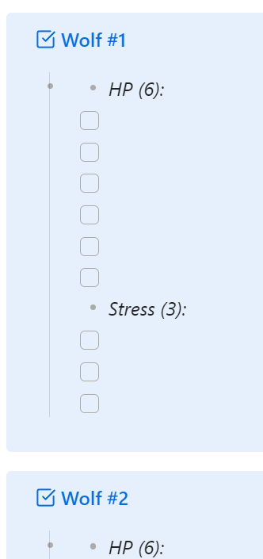

# daggerheart-obsidian-scripts
Scripts to assist in session prep in Obsidian for Daggerheart table top roll playing game.

### Daggerheart
Daggerheart is a table top roll playing game from Darrington Press.
#### Daggerheart trademarks
“Darrington Press™ and the Darrington Press authorized work logo are trademarks of Critical Role, LLC and used with permission.
#### Daggerheart license
This product includes materials from the Daggerheart System Reference Document 1.0, ©Critical Role, LLC. under the terms of the Darrington Press Community Gaming (DPCGL) License. More information can be found at https://www.daggerheart.com. There are no previous modifications by others.
### Obsidian
Obsidian is a note taking application I use from my game preperation. It uses the markdown file format.
[https://obsidian.md](obsidian)
#### Templater
Templater is a Obsidian plugin that enables using JavaScript to modify markdown files.
[https://github.com/SilentVoid13/Templater](Templater)
#### ITS Theme
ITS Theme is an Obsidian theme that people use for roll playing games. It includes an enchancement to how checkboxes behave. Markdown by default handles checkboxes in a list format. ITS Theme will display those checkboxes horizontally. This is usefull for tracking spell slots in DnD or HP and Stress in Daggerheart.
[https://github.com/SlRvb/Obsidian--ITS-Theme](ITS Theme)
## Adversaries HP and Stress
I have included two scripts that I developed to add a way to track HP and Stress of an Adversary.
 - promptHpStress.js 
 - promptHpStressITS.js
I have included two simple templates that invoke these scripts.
 - HP Stress Template.md
 - HP Stress Template ITS.md
### HP Stress Template
This template will prompt the user for an adversaries HP and Stress. Then it will build a markdown table to track 6 adversaries. The following is an example:

| #   | HP(11)        | S(6)    | Status  | Name   |
| --- | ------------- | ------- | ------- | ------ |
|     | xxxxx xxxxx x | xxxxx x | h,r,v   |        |
| A   |               |         |         |        |
| B   |               |         |         |        |
| C   |               |         |         |        |
| D   |               |         |         |        |
| E   |               |         |         |        |
| F   |               |         |         |        |
 ***h: hidden, r: restrained, v: vulnerable***

This looks like the following in Obsidian:

 
### HP Stress Template ITS
This template requires the advanced checkbox feature of the ITS theme. It produces markdown that is less readable without the theme. This markdown was shared by Crit Hit The Giant on youtube in his video "Using Owlbear Rodeo To Run Daggerheart." They stated they got the code from somewhere else to use for Dnd spell slots. The template will ask for the Adversary name, the number of adversaries, HP, and Stress. The following is what is an example of the markdown in produces:
> [!checks | no-i ] Wolf #1
>   - 
>     - *HP (6):*
>     - [ ] 
>     - [ ] 
>     - [ ] 
>     - [ ] 
>     - [ ] 
>     - [ ] 
>     - *Stress (3):*
>     - [ ] 
>     - [ ] 
>     - [ ] 

> [!checks | no-i ] Wolf #2
>   - 
>     - *HP (6):*
>     - [ ] 
>     - [ ] 
>     - [ ] 
>     - [ ] 
>     - [ ] 
>     - [ ] 
>     - *Stress (3):*
>     - [ ] 
>     - [ ] 
>     - [ ] 

> [!checks | no-i ] Wolf #3
>   - 
>     - *HP (6):*
>     - [ ] 
>     - [ ] 
>     - [ ] 
>     - [ ] 
>     - [ ] 
>     - [ ] 
>     - *Stress (3):*
>     - [ ] 
>     - [ ] 
>     - [ ] 

This looks like the following in Obsidian with ITS theme enabled:

This looks like the following in Obsidian with the default theme:

